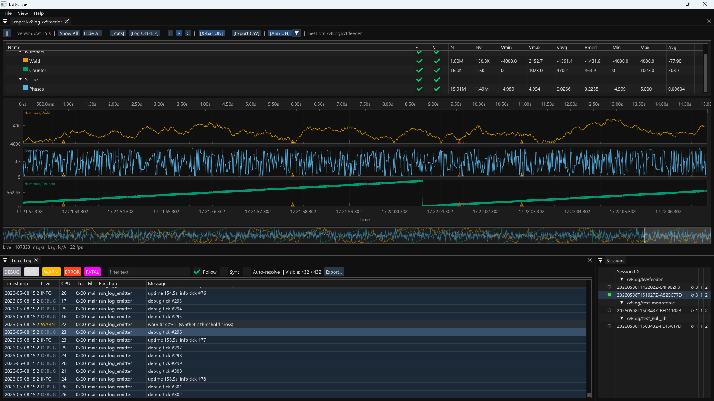

# Kv8 -- Start Here



## What It Is

Kv8 is a C++ telemetry and structured logging toolchain built on Apache Kafka.
Instrument your application with a single header; get live waveform visualization,
searchable trace logs, and persistent replay -- with no measurable overhead on
the hot path.

**For developers**: add `#define KV8_LOG_ENABLE` and two macros to any C++17
codebase. Scalar counters (`KV8_TEL_ADD`) and severity-tagged trace events
(`KV8_LOG_INFO`, `KV8_LOGF_WARN`, ...) are published to Kafka at production
throughput (>2M calls/s). The shared runtime is loaded lazily; no link-time
dependency is added. Everything compiles out to zero instructions when
`KV8_LOG_ENABLE` is absent.

**For R&D managers**: kv8scope is a real-time software oscilloscope that
renders every instrumented metric as a scrolling waveform, overlays the trace
log in a dockable panel tinted by severity (Debug / Info / Warning / Error /
Fatal), and correlates log events to waveform timestamps with a click. Sessions
are recorded to Kafka and can be replayed or analyzed offline at any time.
No proprietary agents, no cloud dependency -- the entire stack runs on a single
Docker container in the lab or on the test vehicle.

---

## Repository Layout

```
libs/kv8log/     -- core telemetry producer library (the "instrument" side)
kv8scope/        -- ImGui software oscilloscope for live waveform visualization
kv8zoom/         -- attitude filter and frame assembler (signal analysis tool)
tools/           -- CLI maintenance and verification tools
  kv8maint/      -- channel/session admin (inspect, audit, delete)
  kv8probe/      -- deterministic synthetic sample producer
  kv8verify/     -- timestamp integrity and sequence continuity checker
examples/        -- standalone example programs
  kv8bench/      -- end-to-end latency and throughput benchmark
  kv8cli/        -- stream telemetry/logs from Kafka to stdout
  kv8feeder/     -- continuous live telemetry producer (scalar + UDT feeds)
docker/          -- docker-compose Kafka broker for local development
```

---

## Core Library: kv8log

The instrumentation API lives entirely behind a single header (`KV8_Log.h`).
All macros compile out to nothing unless `KV8_LOG_ENABLE` is defined -- zero
cost in production builds that omit the flag.

```cpp
#define KV8_LOG_ENABLE          // opt in (typically via -DKV8_LOG_ENABLE in CMake)
#include "kv8log/KV8_Log.h"
```

The shared runtime (`kv8log.so` / `kv8log.dll`) is loaded lazily on first use.
The user application has no link-time dependency on it.

kv8log exposes **three pillars** of telemetry, all sharing the same Kafka
session and the same `_registry` discovery topic:

1. **Scalar counters** -- continuous numeric streams via `KV8_TEL_ADD*`.
2. **UDT feeds** -- structured compound records via `KV8_UDT_*`.
3. **Trace logs** -- discrete severity-tagged events via `KV8_LOG_*` / `KV8_LOGF_*`.

---

### Scalar Telemetry

```cpp
// Declare a named channel (static singleton, once per translation unit).
KV8_CHANNEL(nav, "Aerial/Navigation");

// Declare a counter: name shown in kv8scope, min/max for Y-axis scaling.
KV8_TEL(alt_m, "altitude", 0.0, 10000.0);          // default channel
KV8_TEL_CH(nav, rpm, "motors/rpm", 0.0, 8000.0);   // named channel

// Record samples on the hot path (zero allocation, lock-free).
KV8_TEL_ADD(alt_m, current_altitude);
KV8_TEL_ADD_CH(nav, rpm, motor_rpm);

// Record with a caller-supplied timestamp (nanoseconds since Unix epoch).
KV8_TEL_ADD_TS(alt_m, current_altitude, KV8_MONO_TO_NS(qpc_value));

// Runtime enable / disable per counter (also writes a Kafka control message).
KV8_TEL_ENABLE(alt_m);
KV8_TEL_DISABLE(alt_m);

// Flush: block until all enqueued messages are delivered (or timed out).
KV8_TEL_FLUSH();

// Override broker / credentials before first use (must precede KV8_TEL_ADD).
KV8_LOG_CONFIGURE("localhost:19092", "kv8/myapp", "kv8producer", "kv8secret");
```

Counters are written to Kafka topic `<channel>.<session_id>.<counter_name>`.

---

### Trace Logs

Log records are discrete, severity-tagged events published to Kafka topic
`<channel>.<session_id>._log` and displayed in the kv8scope Log Panel (Ctrl+L)
and in `kv8cli [LOG]` output.

**String-literal macros** (no formatting; `msg_` must be a compile-time literal):

```cpp
KV8_LOG_DEBUG("entering calibration loop");
KV8_LOG_INFO("navigation initialised");
KV8_LOG_WARN("battery below threshold");
KV8_LOG_ERROR("IMU timeout -- using last known pose");
KV8_LOG_FATAL("unrecoverable sensor fault");
```

**Printf-style macros** (format into a 4096-byte stack buffer; truncated
silently at 4095 bytes):

```cpp
KV8_LOGF_DEBUG("frame %u: dt=%.3f ms", frame, dt_ms);
KV8_LOGF_INFO("session started, broker=%s", broker_addr);
KV8_LOGF_WARN("GPS dropout %.1fs -- reverting to INS", dropout_s);
KV8_LOGF_ERROR("altitude OOB: %.1f m (limit %.1f m)", alt, limit);
KV8_LOGF_FATAL("watchdog expired after %u ms", elapsed_ms);
```

**Severity levels** (`Kv8LogLevel` enum, `uint8_t` on the wire):

| Level | Value | kv8scope tint |
|-------|-------|---------------|
| Debug | 0 | gray |
| Info | 1 | white |
| Warning | 2 | yellow |
| Error | 3 | orange-red |
| Fatal | 4 | red |

**Hot-path design**: each call site holds a `static std::atomic<uint32_t>`
that caches the FNV-32 site hash after the first call. Source location
(file, line, function, format string) is registered once into the `_registry`
topic; data records carry only the 4-byte hash, eliminating per-record
string overhead.

**Wire format** (`Kv8LogRecord`, `<kv8/Kv8Types.h>`):

```
Offset  Size  Field
0       4     dwMagic      -- 0x4B563854 ("KV8T")
4       4     dwSiteHash   -- FNV-32 key into _registry
8       8     tsNs         -- wall-clock ns since Unix epoch
16      4     dwThreadID   -- OS thread ID
20      2     wCpuID       -- CPU core index
22      1     bLevel       -- Kv8LogLevel
23      1     bFlags       -- bit 0: payload is UTF-8 text
24      2     wArgLen      -- byte length of payload following this header
26      2     wReserved    -- zero
           [wArgLen bytes of UTF-8 payload]
```

Total fixed header: 28 bytes.

---

### Key Types

| Type | Role |
|------|------|
| `Channel` | One Kafka producer session; lazy-init, thread-safe |
| `Counter` | Named metric with min/max range, bound to a Channel |
| `UdtFeed` | Structured (user-defined type) feed for compound records |
| `Kv8LogRecord` | 28-byte fixed header + payload for one trace-log emission (in `<kv8/Kv8Types.h>`) |
| `Kv8LogLevel` | Severity enum: Debug=0, Info=1, Warning=2, Error=3, Fatal=4 |
| `Runtime` | Opaque handle to the loaded shared library |

---

## kv8scope -- Software Oscilloscope

ImGui/OpenGL desktop application. Subscribes to Kafka, discovers sessions
dynamically, and renders live waveforms per counter.

Architecture highlights:
- `ConsumerThread` pulls decoded samples off Kafka.
- `SpscDynamicRing<TelemetrySample>` (lock-free, cache-line-aligned head/tail)
  bridges the consumer thread to the render thread without mutexes.
- `WaveformRenderer` draws scrolling waveforms via ImGui draw lists.
- `LogStore` + `LogPanel` host a dockable trace-log viewer (Ctrl+L). Rows
  are tinted by severity; clicking a row seeks the waveform timeline.
- `SessionManager` tracks open sessions; `SessionListPanel` lists available ones.
- `StatsEngine` / `StatsPanel` compute and display per-counter statistics.
- `TimeConverter` maps hardware timer ticks to wall-clock UTC using the
  `qwTimerFrequency` + `qwTimerValue` anchor stored in the Kafka registry topic.

---

## kv8zoom (a prototype) -- Frame Assembler / Attitude Filter

Reads raw Kafka telemetry, assembles multi-topic frames time-aligned by the
hardware timestamp, applies an attitude filter (`AttitudeFilter`), and feeds
a decimation-controlled output stream. Useful for post-processing and zoomed
playback.

---

## Architecture Principles

**Zero-allocation hot path** -- buffers are pre-allocated at startup and
recycled via a free list. No heap allocation on the `KV8_TEL_ADD` path.

**Cache-line alignment** -- all shared data structures use `alignas(64)` on
struct definitions and 64-byte-aligned dynamic allocations to prevent false
sharing between producer and consumer threads.

**Lock-free SPSC** -- the render pipeline uses a single-producer /
single-consumer ring buffer (power-of-two capacity, acquire/release atomics)
between the Kafka consumer thread and the ImGui render thread.

**Compile-out by default** -- `#define KV8_LOG_ENABLE` is the explicit opt-in.
Uninstrumented builds carry exactly zero overhead.

**Lazy runtime loading** -- `kv8log.dll` / `kv8log.so` is `dlopen`-ed on first
use; applications do not need to be relinked to disable telemetry.

---

## Build

Two scripts handle everything: `bootstrap` installs prerequisites once,
`build` configures and compiles.  Both must be run from the repository root.

### Windows

**Step 1 -- install prerequisites (once)**

```powershell
.\scripts\bootstrap.ps1
```

What it does:
- Verifies Git, CMake >= 3.20, and Visual Studio 2022 with the C++ workload.
- Clones and bootstraps vcpkg at `%USERPROFILE%\vcpkg` (pass `-VcpkgRoot
  <path>` to override).
- Installs all required vcpkg packages (librdkafka, GLFW, OpenGL, nlohmann-json,
  libuv, zlib, openssl).
- Writes `VCPKG_ROOT` to the user environment so new terminals pick it up
  automatically.
- If vcpkg is already in place, pass `-SkipVcpkg` to skip the clone/update step.

**Step 2 -- build**

```powershell
.\scripts\build.ps1             # Release (default)
.\scripts\build.ps1 -Debug      # Debug
.\scripts\build.ps1 -Test       # Release + run CTest (14 tests)
.\scripts\build.ps1 -Install    # Release + install to build/_output_/bin/
.\scripts\build.ps1 -Clean      # wipe build/ then rebuild
.\scripts\build.ps1 -Jobs 8     # explicit parallel job count
```

Binaries land in `build/_output_/bin/` after `-Install`.

---

### Linux

**Step 1 -- install prerequisites (once)**

```sh
./scripts/bootstrap.sh
```

What it does:
- Detects the package manager (apt / dnf / pacman) and installs: gcc/g++,
  cmake, make/ninja, pkg-config, librdkafka-dev, libglfw3-dev, libgl-dev,
  libuv1-dev, nlohmann-json3-dev, zlib1g-dev, libssl-dev.
- Reports Docker status (required for the Kafka broker used in integration
  tests; not auto-installed).
- Pass `--no-docker` to skip the Docker check.

**Step 2 -- build**

```sh
./scripts/build.sh              # Release (default)
./scripts/build.sh --debug      # Debug
./scripts/build.sh --test       # Release + run CTest
./scripts/build.sh --install    # Release + install to build/_output_/bin/
./scripts/build.sh --clean      # wipe build/ then rebuild
./scripts/build.sh --jobs 8     # explicit parallel job count
```

---

### Local Kafka broker

Both platforms share the same Docker-based broker:

```sh
# start
cd docker && docker compose up -d

# stop + remove volumes
cd docker && docker compose down -v
```

Broker: `localhost:19092`, SASL/PLAIN, credentials `kv8producer` / `kv8secret`.

A convenience end-to-end test script is also available:

```powershell
.\scripts\test_kafka_e2e.ps1         # Windows
```
```sh
./scripts/test_kafka_e2e.sh          # Linux
```

**Dependencies**: librdkafka (vcpkg on Windows, system package on Linux),
Dear ImGui, GLFW, OpenGL; C++17; CMake >= 3.20.

---

## Packaging

CPack produces two component archives from the same build tree:

| Component | Contents |
|-----------|----------|
| `kv8-runtime` | Compiled binaries (kv8scope, kv8zoom, tools, examples) |
| `kv8-sdk` | kv8log facade library + public headers for instrumenting your own code |

### Windows -- ZIP archives

Run from the repository root after a successful build:

```powershell
cpack --preset win-release
```

Or without presets:

```powershell
cmake --build build --target PACKAGE
```

Two ZIP files are written to `build\`:

```
Kv8-<version>-Windows-AMD64-kv8-runtime.zip
Kv8-<version>-Windows-AMD64-kv8-sdk.zip
```

### Linux -- TGZ archives

```sh
cpack --preset linux-release
```

Or without presets:

```sh
cmake --build build --target package
```

Two tarballs are written to `build/`:

```
Kv8-<version>-Linux-x86_64-kv8-runtime.tar.gz
Kv8-<version>-Linux-x86_64-kv8-sdk.tar.gz
```

---

## ML Extension (MODEL.md)

Describes but does not yet ship a full `kv8infer` consumer: offline training
(Isolation Forest + LSTM Autoencoder via scikit-learn / PyTorch), ONNX export,
and a lightweight C++ inference consumer that publishes anomaly scores back to
Kafka at 20 Hz. kv8scope would overlay the score as a live waveform channel.
